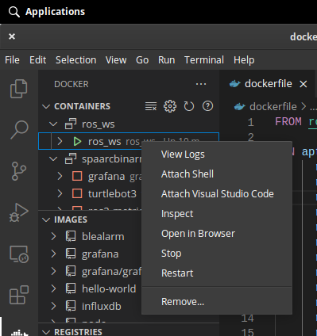

## About
The repo is used to set up a ros development environment on any system. 

## Getting Started
1) Build the docker image
```
docker-compose build
```
2) To enable GUI applications (options and a security risk)
```
xhost +local:root
```
3) Run the docker container
```
docker-compose up
```
4) Attached VSCode to the docker container. Note you will need the docker plugin install in your VSCode



5) Source ROS and your workspace overlays
```
source /opt/ros/melodic/setup.bash; source /ros_ws/devel/setup.bash
```
